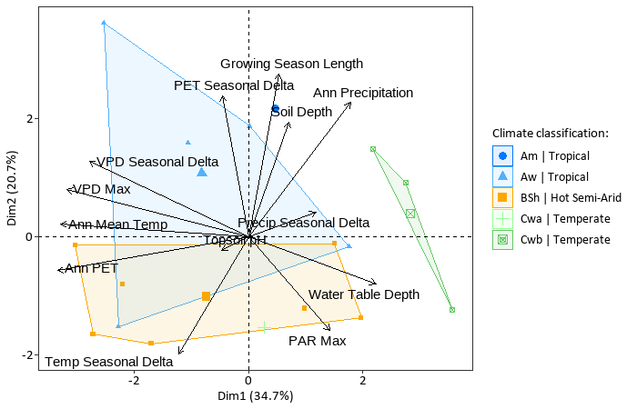
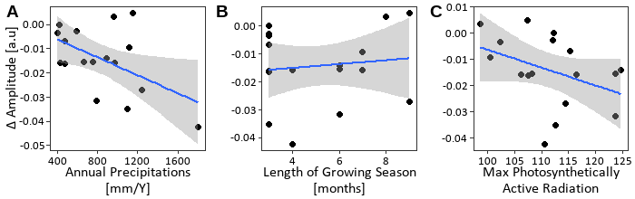

# Sorghum Ecotype Environmental Analysis & Circadian Plasticity Modeling

**Author:** Nitzan Weisman 
**Date:** 25/5/25 
**Portfolio Piece:** Application of data analysis and statistical modeling in R for biological research. 
**Source:** Key analyses adapted from Master's Thesis, "Stress and Environmental Influence on Circadian traits Plasticity," The Hebrew University of Jerusalem (March 2024).

## Overview

This repository presents two interconnected R-based analyses from a study on sorghum (*Sorghum bicolor*) ecotypes. The work involves exploring the environmental conditions of their origin sites and modeling the plasticity of their circadian rhythms in response to temperature. These projects demonstrate approaches to data analysis and statistical interpretation within a biological context.

1.  **Project 1: Environmental Niche Characterization using PCA**
    *   **Objective:** To explore and reduce the dimensionality of environmental parameters from diverse sorghum ecotype origin sites across Africa, identifying key environmental gradients and visualizing relationships between variables.
    *   **Methods Applied:** Data preparation, multicollinearity assessment, Principal Component Analysis (PCA), data visualization.

2.  **Project 2: Predicting Circadian Plasticity with Multi-Model Averaging (MMA)**
    *   **Objective:** To model the plasticity of sorghum circadian traits (Δ Amplitude, Δ RAE, Δ RF) in response to temperature changes, using environmental factors from origin sites as predictors. Multi-model averaging was employed to identify significant predictors and account for model selection uncertainty.
    *   **Methods Applied:** Linear modeling, Variance Inflation Factor (VIF) analysis for multicollinearity, multi-model inference (using `MuMIn`), model assessment, results interpretation.

---

## Project 1: Environmental Niche Characterization using PCA

### Statistical Rationale & Approach

To understand the diverse environmental conditions shaping sorghum ecotypes, a dataset of 35 environmental parameters was initially considered.

1.  **Collinearity Assessment:** An initial screening was performed to identify and reduce redundancy among these parameters by examining correlation matrices (e.g., for temperature, precipitation, PAR groups). This led to the selection of 13 key environmental variables for the main PCA.
    *   *Reasoning:* Reducing highly correlated variables improves the interpretability and stability of PCA.

2.  **Data Standardization:** The selected 13 environmental variables were standardized (mean 0, SD 1) using `vegan::decostand`.
    *   *Reasoning:* PCA is sensitive to variable scales; standardization ensures all variables contribute equitably to the analysis.

3.  **Principal Component Analysis:** PCA was performed using `stats::prcomp`.
    *   *Reasoning:* To transform the correlated environmental variables into a smaller set of uncorrelated principal components (PCs) that capture the maximum variance in the data, allowing for visualization of major environmental gradients.

4.  **Visualization:** Results were visualized using `factoextra::fviz_pca_biplot`, with ecotypes colored by Köppen-Geiger climate classification.

    *Figure 1: PCA Biplot of Sorghum Ecotype Origin Environments*
    *(Thesis Figure 3: Illustrates complex multi-dimensional environmental data. PCA loading vectors (arrows) offer insights into variable relationships. For example, water availability parameters show varying directions, suggesting complex patterns beyond simple correlations. Seasonal temperature difference and annual precipitation loading vectors are in opposite directions, fitting known patterns of high rainfall and minimal seasonal temperature variation in tropical climates versus less precipitation and high temperature variance in semi-arid climates. The separation of tropical and semi-arid climate types is visible.)*
    

### Key Findings from PCA

*   The PCA biplot (Figure 1) effectively visualized the complex relationships between multiple environmental parameters and highlighted how using a comprehensive set of 13 environmental variables provides a fuller characterization of the plant environment than a single generalizing climate type.
*   Ecotype origin sites clustered meaningfully according to their broad climate classifications (e.g., tropical vs. semi-arid) along the principal components, confirming major environmental gradients.

**Code:** `pca.R`

---

## Project 2: Predicting Circadian Plasticity with Multi-Model Averaging (MMA)

### Statistical Rationale & Approach

This analysis aimed to identify which environmental factors from ecotype origin sites best predict the plasticity of circadian traits (ΔTrait = Trait at 22°C - Trait at 35°C).

1.  **Plasticity Calculation:** Delta values (ΔAmplitude, ΔRAE, ΔRF) were calculated to quantify the change in circadian traits between the two temperature conditions.
2.  **Initial Model & VIF Reduction:** For each Δtrait, an initial linear model (`lm`) was built using all 13 selected environmental predictors. Variance Inflation Factor (VIF) analysis (`car::vif`) was used to iteratively remove predictors with VIF > 4-5, addressing multicollinearity.
    *   *Reasoning:* Ensures a set of relatively independent predictors for more stable coefficient estimates.
3.  **Multi-Model Averaging (MMA):**
    *   All possible subset models were generated from the VIF-reduced predictor set using `MuMIn::dredge`.
    *   Models were ranked by AICc (Akaike Information Criterion corrected for small samples).
    *   Models with substantial support (ΔAICc < 2) were averaged using `MuMIn::model.avg`.
    *   *Reasoning:* MMA accounts for model selection uncertainty, providing more robust estimates of predictor effects and importance.
4.  **Model Performance Assessment:** The predictive quality of each final averaged model was assessed by the R-squared and p-value from a simple linear regression of its predicted Δtrait values against the observed Δtrait values.

      *Table 1a: Averaged Multi-Model Coefficients for ΔAmplitude Plasticity*

    | Variable                                           | Coefficient | Std. Error | P-value  | Significance | Importance |
    |----------------------------------------------------|-------------|------------|----------|--------------|------------|
    | Annual Precipitation (Ann Precipitation) [mm]    | -3.25E-05   | 8.38E-06   | 0.000343 | ***          | 1 (2/2)    |
    | Growing Season Length (GSL) [months]             | 3.22E-03    | 1.18E-03   | 0.013225 | *            | 1 (2/2)    |
    | Maximum Photosynthetically Active Radiation (Max PAR) [W/m²] | -7.92E-04   | 3.00E-04   | 0.01619  | *            | 1 (2/2)    |
    | Annual mean Temperature [°C]                       | -3.20E-04   | 5.41E-04   | 0.570057 |              | 0.35 (1/2) |

    *Table 1b: Model Performance for ΔAmplitude Plasticity (Prediction vs. Observation)*

    | Metric                 | Value       |
    |------------------------|-------------|
    | Model adjusted R-sqr | **0.6705**  |
    | Model p value          | **3.55E-05**|

    *Figure 2: Relationship between Significant Predictors and ΔAmplitude*
    *(Thesis Figure 11: Illustrates correlations between ΔAmplitude and average multi-model selected significant environmental parameters: Annual Precipitation, Growing Season Length, and Max PAR.)*
    

### Key Findings from MMA

*   **ΔAmplitude:** As shown in Table 1a, ΔAmplitude was significantly predicted by Annual Precipitation, Growing Season Length, and Max PAR. The overall model performance (Table 1b) shows an Adjusted R-squared of approximately 67.1%. (See Figure 2 for predictor relationships).
*   **ΔRAE (Accuracy):** Significantly predicted by Max PAR, Annual Precipitation, and GSL. The averaged model explained approximately 72.6% of the variance.
*   **ΔRF (Rhythmicity):** Primarily predicted by Max PAR. The averaged model explained approximately 40.0% of the variance.
*   *Interpretation:* These results indicate that long-term environmental conditions related to water availability, growing season duration, and light environment at ecotype origin sites are significantly linked to how sorghum modulates its circadian rhythm parameters in response to temperature stress.

**Code:** `mma.R`

---

## Data

The primary dataset used for these analyses is `Sorghum_initial_screening_2.csv`, available upon request. It contains sorghum ecotype information, environmental parameters for their origin sites, and measured circadian trait data.

## Software and Packages

*   R (Version [Your R Version, e.g., 4.x.x])
*   Key R Packages: `tidyverse`, `vegan`, `factoextra`, `GGally` (for PCA project); `tidyverse`, `car`, `MuMIn`, `ggpubr`, `gridExtra` (for MMA project).

---
